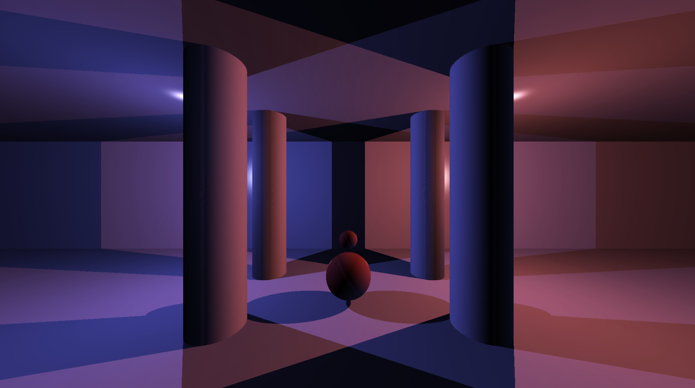
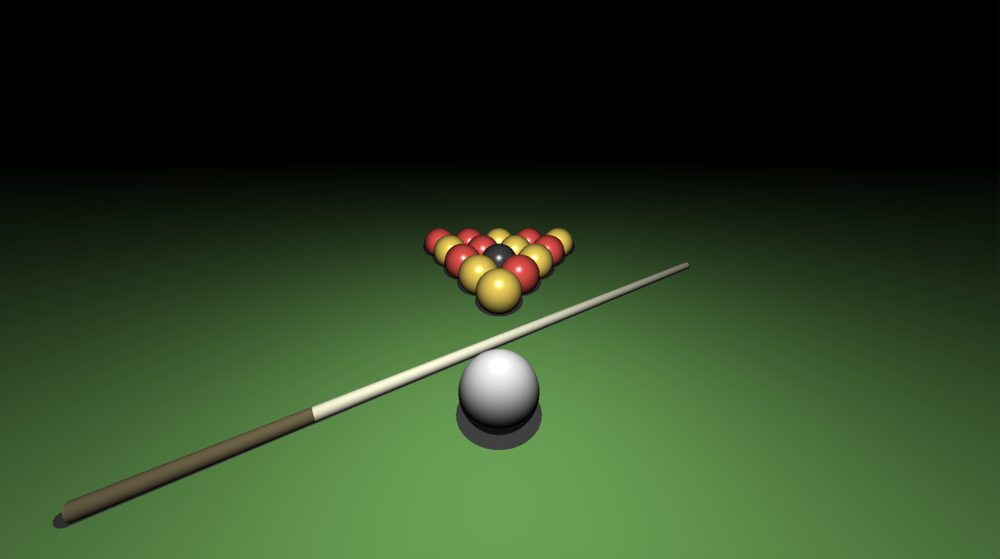
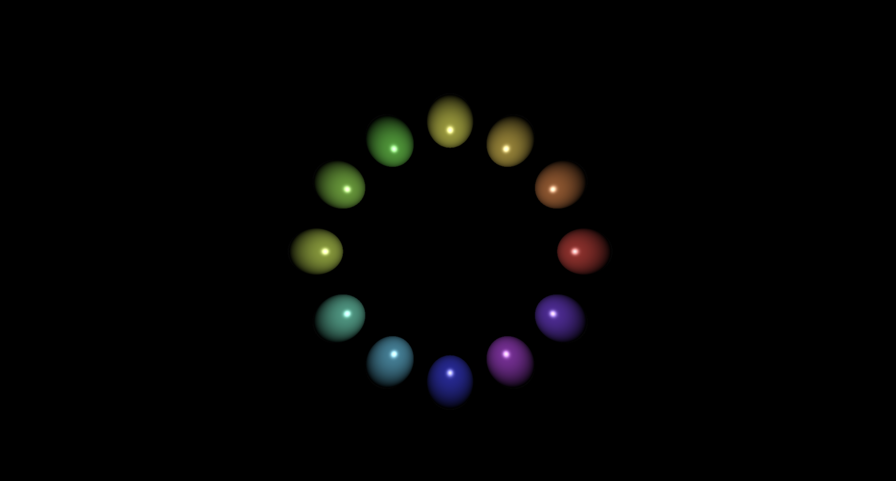

# MiniRT - A Raytracing Engine in C

 

  <h3 align="center">A physically-based rendering engine built from scratch</h3>

## 🗣️ About The Project

**MiniRT** is a project developed at **42 School** as an introduction to Computer Graphics. The goal is to build a Raytracer capable of generating realistic images by simulating the physics of light paths.

Unlike modern engines that rely on OpenGL or Vulkan pipelines, this project requires **rendering directly to the pixel buffer** using pure CPU calculations. It serves as a rigorous exercise in **Linear Algebra**, **Vector Geometry**, and **Software Optimization**.

### 🎯 Key Engineering Goals
- **Linear Algebra Implementation:** Developing a custom math library to handle vectors, matrices, dot products, and normalization without external dependencies.
- **Physics Simulation:** Calculating ray-object intersections (Sphere, Plane, Cylinder) using quadratic equations and geometric logic.
- **Lighting Model:** Implementing ambient, diffuse, and specular lighting (Phong shading) to simulate realistic materials.
- **Coordinate Systems:** Managing transformations between World Space and Camera Space using transformation matrices.

---

## 🏗️ Architecture

The rendering pipeline follows a strict mathematical flow to convert a 3D scene into a 2D image:

1.  **Scene Parser:** Reads a `.rt` configuration file to load objects, lights, and cameras into memory structures.
2.  **Ray Generation:** For every pixel on the screen, a "Ray" is cast from the camera origin through the viewport.
3.  **Intersection Engine:** The system solves algebraic equations to find the closest object hit by the ray.
4.  **Shader Calculation:** If a hit occurs, the pixel color is calculated based on:
    * Surface Normal at the hit point.
    * Light direction and intensity.
    * Shadows (checking if the light source is obstructed).
5.  **Rasterization:** The final color is written to the MiniLibX image buffer.

---

## 🛠️ Technical Implementation Highlights

### 1. Vector Math & Geometry
The core of the engine is a custom-built math library. Every movement, rotation, and light calculation relies on vector arithmetic.
* **Challenge:** Correctly calculating the surface normals for cylinders and transforming them when the object is rotated required complex trigonometric implementations.

### 2. Camera & Field of View (FOV)
Implementing a movable camera required understanding **Camera-to-World** matrices. The rays are generated based on the FOV angle, ensuring that the perspective projection is mathematically correct—a concept fundamental to flight simulators and 3D navigation.

### 3. Optimization
Since Raytracing is computationally expensive ($O(pixels \times objects)$), efficiency was key.
* **Optimization:** Minimized expensive operations (like `sqrt` and `pow`) inside the main rendering loop where possible to maintain reasonable render times on the CPU.

---

## ⚡ Features

* **Geometric Primitives:** Spheres, Planes, Cylinders.
* **Lighting:**
  * Ambient Light (Base illumination).
  * Diffuse Light (Directional impact).
  * Shadows (Hard shadows).
* **Camera:** Multi-camera support with adjustable FOV and position/orientation.
* **Scene Control:** Zoom, translation, and rotation (if implemented).
* **Robust Parsing:** Error handling for misconfigured scene files.

---

## 🚀 Installation & Usage

### Requirements
* GCC or Clang
* GNU Make
* MiniLibX (included or installed on system)
* X11 headers (for Linux)

### Build and Run
~~~bash
# Clone the repository
git clone https://github.com/eandres83/minirt.git

# Enter the directory
cd minirt

# Compile
make

# Run with a scene file
./miniRT scenes/example.rt
~~~

### Controls (Example)
* `ESC`: Exit
* `W/A/S/D`: Move Camera
* `Arrows`: Rotate Camera

---

## 🖼️ Gallery

Here are some scenes rendered directly with the engine:

  
  

  
  

---
*Developed by Eleder Andres as part of the Computer Graphics curriculum.*
